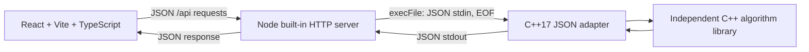

# Food Delivery Rider Assignment Based on Minimum Distance

A small, working DAA algorithm lab built with React + Vite + TypeScript, a
lightweight Node HTTP bridge, and the tested C++17 algorithms from Sprint 1.
The coordinate map replays actual C++ greedy decisions and compares their total
with the exhaustive global minimum. No assignment algorithm is implemented in
JavaScript.

## Problem, objective, and proposed solution

Given R riders and O order locations on a flat coordinate plane, choose exactly
min(R,O) pairs. Each rider and order may appear at most once. Minimize the sum
of their Euclidean distances. A **globally optimal solution** here means the
minimum total Euclidean distance among all feasible assignments with exactly
min(R,O) pairs; it does not mean an optimal real-world delivery route.

The proposed greedy solution scans every currently available rider–order pair,
chooses the shortest, commits it, and removes both members. It is simple,
deterministic, and easy to explain, with polynomial rather than factorial
work. The selected pair is locally optimal because no available pair is
shorter. That saving can remove alternatives that would reduce the combined
cost of later assignments, so greedy has no global optimality guarantee.

Baseline exhaustive backtracking visits the smaller group in input order and
tries each unused member of the larger group. This covers every subset and
arrangement of the larger group, including unequal counts. It accumulates
distance during recursion and retains the lowest-total complete assignment.
There is no Hungarian method, branch-and-bound, or partial-total pruning.
Equal greedy distances use original rider index, then order index. Equal
exhaustive totals retain the first complete assignment encountered.

The verified failure example gives greedy **7**, optimal **5**, absolute
difference **2**, and greedy overhead **40%**. The UI starts with this example.

## Architecture



`backend/GreedyAssignment.cpp`, `OptimalAssignment.cpp`, and `Distance.cpp`
retain the Sprint 1 algorithm implementation. `JsonProtocol.cpp` validates
and serializes at the C++ boundary, and measures algorithm execution.
`main.cpp` reads one request per process and writes one JSON response.
Diagnostics go to stderr. Node uses built-in HTTP and child-process facilities,
launches the already-built executable without a shell, and forwards its results.
C++ is compiled during setup/build, never during an HTTP request.

The maintained [nlohmann/json v3.12.0](https://github.com/nlohmann/json/releases/tag/v3.12.0)
single header and MIT license are pinned and vendored. Builds need no JSON
package installation or network download. Source and verified SHA-256 checksum
are in [backend/third_party/README.md](backend/third_party/README.md). Frontend
and browser-test packages use exact versions in `package.json` and a
`package-lock.json` for repeatable installation.

```text
backend/                 C++ structs, algorithms, JSON adapter, executable
  tests/                 C++ oracle suite and real HTTP integration tests
  third_party/           Pinned JSON parser and license
bridge/server.mjs        Built-in Node HTTP / child-process bridge
frontend/                React / Vite / TypeScript app and CSS
  src/useSimulation.ts   Replay state, cancellation, stale-response protection
  src/CoordinateMap.tsx  Responsive SVG with equal axis scale
  src/App.tsx            Editors, controls, tables, comparison, explanations
  vite.config.ts         Localhost server and /api proxy
datasets/                Twelve independently verified fixtures
playwright.config.ts     Production-preview browser test configuration
tests/browser/           Focused browser regression tests
ALGORITHM.md             Pseudocode, proofs, exact complexity, walkthrough
```

## Prerequisites and exact setup

These commands target macOS/Linux shells. Install Node **20.19+ in the 20.x
line, or 22.12+**, npm, CMake **3.16+**, and a C++17 compiler (Clang or GCC).
On macOS, the Xcode Command Line Tools provide Clang. No global npm package is
required. Run all commands from the project folder:

```sh
npm ci
npm run build
```

`npm run build` runs these separately available commands:

```sh
npm run build:backend   # CMake Release build, including C++ tests
npm run build:frontend  # TypeScript check + Vite production build
```

Start the API in terminal 1:

```sh
npm run dev:api
```

Start the frontend in terminal 2:

```sh
npm run dev
```

Open **http://127.0.0.1:5173/**. Both servers bind to localhost. Vite proxies
`/api` to `http://127.0.0.1:3001`, so the browser uses a same-origin API.
`PORT` changes the Node port; if changed, update the Vite proxy target too.
`RIDER_EXECUTABLE` can override the executable path (for another build directory).
No compile step is performed by the server.

To serve and inspect the built frontend instead of development mode:

```sh
npm run preview
```

Open **http://127.0.0.1:4173/**; preview uses the same API proxy. Keep the API
running. Preview is a local verification server, not a production deployment.

## Run tests

After building:

```sh
npm test                 # CTest: C++ suite + CLI/real HTTP suite
npm run test:cpp          # 216 valid cases, oracle and invariant checks
npm run test:api          # CLI and real HTTP integration tests directly
npm run test:browser      # Browser flow against production preview + real API
```

Browser tests require a compatible Chromium browser. On this Mac they use the
installed Google Chrome. Elsewhere, install Playwright's pinned Chromium:

```sh
npx playwright install chromium
npm run test:browser
```

Set `PLAYWRIGHT_BROWSER_CHANNEL=chrome` to use an installed Chrome explicitly.
The browser runner starts the API and production-preview server when not
already running; it reuses existing local servers outside CI. Build first.
Reports/screenshots are written to ignored `playwright-report/` and
`test-results/`. `npx playwright show-report` opens the last HTML report.
Restricted environments need permission for local listening and browser launch.

Optional Clang/GCC sanitizer verification:

```sh
cmake -S backend -B build-sanitized -DCMAKE_BUILD_TYPE=Debug -DENABLE_SANITIZERS=ON
cmake --build build-sanitized -j 4
ctest --test-dir build-sanitized --output-on-failure
```

CMake registers Node integration tests when Node is available. Assertions in
our C++ test harness remain active in Release builds.

## API contract

| Method | Endpoint | Result |
| --- | --- | --- |
| GET | `/api/health` | Executable readiness, configured limits, active-process count |
| POST | `/api/greedy` | Greedy result with complete candidate/selection trace |
| POST | `/api/optimal` | Exhaustive result and complete-assignment count |
| POST | `/api/compare` | Both results, absolute difference, overhead percentage |

POST requests require `Content-Type: application/json` and both arrays:

```json
{
  "riders": [{"id": "R1", "x": 0, "y": 0}],
  "orders": [{"id": "O1", "x": 1, "y": 0}]
}
```

Example requests:

```sh
curl http://127.0.0.1:3001/api/health
curl -X POST http://127.0.0.1:3001/api/compare \
  -H 'Content-Type: application/json' \
  --data-binary @datasets/greedy_failure.json
```

Greedy and optimal endpoints return a result directly. Compare returns
`greedy`, `optimal`, `comparison`, and outer `timing`. Each algorithm result
contains assignments, total distance, separate unassigned rider/order ID lists,
`statistics`, `executionTimeMs`, `timingScope`, `explanation`, and `steps`.
Every greedy step contains every available candidate, the selected pair with
original zero-based indices, a one-based iteration, and cumulative total.
Exhaustive `steps` is empty. Greedy assignment order is replay order; exhaustive
assignment order follows the smaller group.

For the one-pair input above, a compact excerpt of the real compare response
(with timing and repeated trace fields omitted for readability) is:

```json
{
  "greedy": {
    "assignments": [{"riderId": "R1", "orderId": "O1", "distance": 1.0}],
    "totalDistance": 1.0,
    "unassignedRiderIds": [],
    "unassignedOrderIds": [],
    "statistics": {"distanceEvaluations": 1, "completeAssignments": 0}
  },
  "optimal": {
    "assignments": [{"riderId": "R1", "orderId": "O1", "distance": 1.0}],
    "totalDistance": 1.0,
    "unassignedRiderIds": [],
    "unassignedOrderIds": [],
    "statistics": {"distanceEvaluations": 1, "completeAssignments": 1}
  },
  "comparison": {
    "difference": 0.0,
    "absoluteDifference": 0.0,
    "greedyOverheadPercent": 0.0,
    "explanation": ""
  }
}
```

The overhead formula is `100 * (greedyTotal - optimalTotal) / optimalTotal`.
If both totals are zero, overhead is **0** with an explanation. If the optimal
total is zero and the greedy total is nonzero, the percentage is **null** with
an explanation. Nonfinite percentages are never serialized as NaN/Infinity.
C++ performs comparison calculations. Totals remain unrounded; the UI formats
distances to three decimals only for display.

The command-line protocol remains available independently of HTTP:

```sh
./build/rider_assignment < datasets/greedy_failure.json
```

It accepts `algorithm: "greedy" | "optimal" | "both"` (default `both`) and
returns wrapped result(s). Send one JSON object, then close stdin. Success
exits 0; an error exits 1 with a structured JSON error on stdout and diagnostics
on stderr. Extra fixture metadata is ignored. Sprint 1 `/health` and `/assign`
HTTP aliases remain for compatibility (`/assign` now requires JSON content type).

## Validation, limits, and errors

Both the API and the C++ JSON boundary independently enforce:

- At most **8 riders and 8 orders**, bounding exhaustive leaves at **40,320**.
- Both arrays are required. Empty arrays are valid: zero assignments, total
  zero, an explanation, and all IDs from the nonempty group unassigned.
- IDs contain text, are at most **32 UTF-8 bytes**, and are unique within their
  respective group. A rider ID may equal an order ID. IDs are not silently trimmed.
- Coordinates are finite numeric values in **[−1000,1000]** on both axes.
  Negative coordinates are valid; strings, nulls, booleans, missing coordinates,
  and nonfinite values are rejected.
- At most **64 KiB** input, independently at HTTP and stdin boundaries.

The Node bridge allows **two active C++ processes**, with no unbounded queue.
A busy request receives 503 and `Retry-After: 1`. Processes time out after
**5 seconds**, are forcibly terminated, and release their slot. Output is
limited to 2 MiB. Disconnected clients terminate their child process. The
health endpoint checks the executable exists and is executable, but does not
run an assignment or guarantee future process success.

Errors consistently use this envelope:

```json
{"error":{"code":"INVALID_INPUT","message":"riders contains duplicate ID \"R1\"."}}
```

| HTTP status | Meaning |
| --- | --- |
| 400 | Malformed JSON or request-read failure |
| 404 / 405 | Unknown endpoint / wrong method |
| 413 / 415 | Body too large / unsupported content type |
| 422 | Invalid fields or C++ boundary rejection |
| 502 | Child crash, invalid response, or output failure |
| 503 | Missing/non-executable C++ binary or occupied local execution slots |
| 504 | Child-process timeout |

A missing executable error names `npm run build:backend` as the recovery step.
The frontend gives a Retry control for failed requests. Input changes and Reset
abort requests, increment a generation token, clear results, and stop playback.
Late responses cannot restore obsolete results; timers are cleaned up on
pause, reset, input change, and component unmount.

## Complexity and timing

Let m=min(R,O), M=max(R,O), and n be the common size for equal groups. See
[ALGORITHM.md](ALGORITHM.md) for exact loop counts, copying costs, and proofs.

| | Greedy | Exhaustive baseline |
| --- | --- | --- |
| Main time | O(R × O × m), O(n³) when equal | O(n × n!) when equal |
| Complete assignments | One greedy assignment | P(M,m)=M!/(M−m)! |
| Auxiliary memory | O(R+O) | O(R+O), including O(m) recursion |
| Returned trace | Σ(k=0..m−1)(R−k)(O−k) candidates; O(n³) when equal | No greedy trace, only best assignment |

Validation adds O(R log(R+1) + O log(O+1)) time; output/unassigned reconstruction
adds O(R+O). Exhaustive work includes an M-candidate loop at every internal
node and copying m assignments whenever the best improves. Counting leaves
alone understates this implementation's cost. JSON and HTTP buffering require
space proportional to the serialized result, in addition to algorithm space.

C++ `executionTimeMs` uses a steady clock around the algorithm call, including
core validation and greedy trace construction, but excluding JSON parsing,
serialization, process startup, and HTTP. Node `processElapsedMs` includes
startup and CLI JSON work; `serverElapsedMs` includes body reading and API work.
The browser independently measures request-and-response parsing time. The UI
labels these separately. Timing is illustrative: one tiny end-to-end request
cannot establish that C++ is faster or that greedy always appears faster.
Operation and exhaustive-assignment counts are dependable evidence of growth.
At 8 equal pairs, greedy evaluates 204 distances and exhaustive evaluates
40,320 complete assignments; at 10 equal pairs, exhaustive would have 3,628,800
leaves and is outside this prototype's interface limit.

## Verified datasets and actual verification

All twelve fixtures are tested through compiled C++, all three HTTP algorithm
endpoints, and the production frontend's dataset selector. IDs follow coordinate
order. Supplied expected totals are assertions, never used to compute results.

| Dataset | Greedy | Optimal | Notes |
| --- | ---: | ---: | --- |
| Simple | 3 | 3 | Greedy matches optimal for this dataset |
| Greedy failure | 7 | 5 | Difference 2, overhead 40% |
| Unequal counts | 2 | 2 | R3 remains unassigned |
| Larger fixed | 30.605384854352774 | 23.077520809352354 | Six pairs, 720 exhaustive leaves |

Additional fixtures cover empty groups, more orders, negative coordinates,
coincident/zero points, deterministic ties, and an unrounded near tie. The
full fixture table and verification record are in
[datasets/README.md](datasets/README.md).

On this environment, **216 valid C++ cases plus invalid-input checks**, **14
CLI/real HTTP test groups**, and **28 Chromium browser tests** passed. Release
and sanitizer CTest each passed both suites (2/2). The TypeScript check, Vite
production build, and clean lockfile installation using cached packages passed.
Browser checks exercise all fixtures, actual replay/selection, input invalidation,
manual empty groups, reset/pause, slow stale responses, error retry, seeded
generation, keyboard focus, reduced motion, and content visibility without
IntersectionObserver. Responsive screenshots were inspected at 320×740,
390×844, 820×1180, and 1440×1000. Detailed counts and remaining verification
limits are recorded in the dataset verification record rather than inferred
from unexecuted checks.

Actual prototype screenshots are saved in `docs/screenshots/`, including the
[verified 7/5/40% comparison](docs/screenshots/greedy-failure-comparison.png),
[desktop](docs/screenshots/desktop.png), [tablet](docs/screenshots/tablet.png),
and [mobile](docs/screenshots/mobile.png) layouts.

## Demonstration for your lecturer

1. Start both local servers and open the lab. Leave **Greedy failure · 7 vs 5**
   selected, or choose it and press **Load Example Dataset**.
2. Explain the objective: assign three distinct pairs with minimum combined
   Euclidean distance. Point out indigo rider circles and orange order squares.
3. Press **Start**. The C++ trace is computed, but no pair is committed in the
   replay yet. Press **Next Step**: nine pairs are listed and R1→O1 wins the
   distance-1 tie by rider input index. Both markers become assigned.
4. Press **Run Automatically**. The remaining choices are R3→O3=1 and R2→O2=5.
   The greedy total reaches **7**. The current candidate table remains visible.
5. Press **Find Optimal Assignment**. Show the exhaustive assignment
   R1→O2=2, R2→O1=2, R3→O3=1: **5**, difference **2**, overhead **40%**.
   Toggle **Greedy / Optimal / Both** on the map to explain the tradeoff.
6. Point to **14 distance evaluations** and **6 complete exhaustive assignments**.
   Explain that counts demonstrate work; the separate timing fields are illustrative.
7. Load **Unequal counts** to show R3 unassigned, then **Simple** to show a case
   where greedy matches optimal without proving a general guarantee.
8. Optionally load **Coincident points**: both totals and overhead are zero.
   Edit an input to show results invalidation; Reset stops any automatic playback.

## Report and PPT handoff

[REPORT_AND_PPT_PROMPT.md](REPORT_AND_PPT_PROMPT.md) contains a ready-to-send
prompt for creating the academic report and presentation from this repository.
Repository URL, college, faculty, and team details are deliberately blank.
Fill the repository URL after pushing, then share the prompt and repository
access with your teammate. The report and PPT themselves are not generated by
the coding prototype.

## Limitations and possible improvements

The map uses a flat plane and a common coordinate unit. This is a simplified
geographic model assigning riders to order locations, without road networks,
delivery routes, pickup locations, traffic, travel times, schedules, priorities,
or multiple orders per rider. Algorithms use finite double arithmetic, not exact
real-number arithmetic. The exhaustive baseline grows factorially. The eight
member cap and local timeout protect this educational simulation, not a
production delivery service.

The bridge starts a process per request, buffers output, and has no persistence,
authentication, or deployment packaging. Development and preview are local-only.
Very long IDs are shortened on the map with the full ID available in marker
titles and tables. Coincident markers remain at their true locations; leader
labels identify the individual entities. Candidate tables scroll within their
panel. Keyboard and reduced-motion behavior were tested in Chromium; other
browsers and assistive technologies still deserve separate real-device testing.

Future work could replace Euclidean distance with road/travel-time costs,
incorporate pickups and capacities, compare with scalable exact matching,
and collect larger repeated benchmarks under controlled conditions. These
would change or extend the current model and are not implemented here.
The requested backend, frontend, and prototype verification are complete;
no PPT, formal project report, or separate viva Q&A document has been created.
